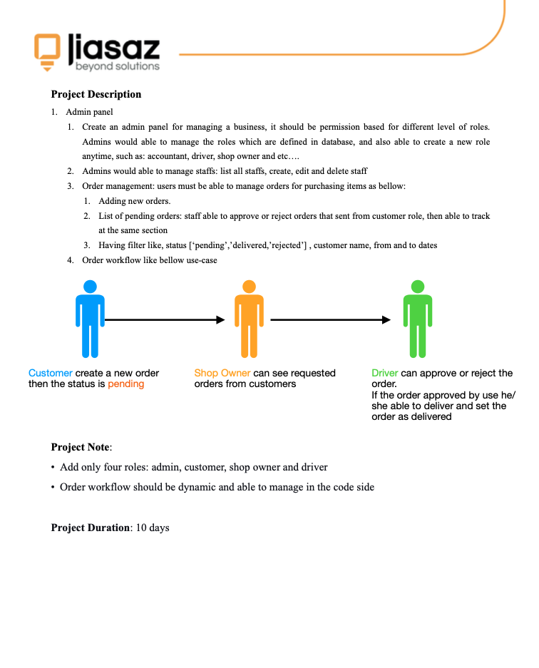
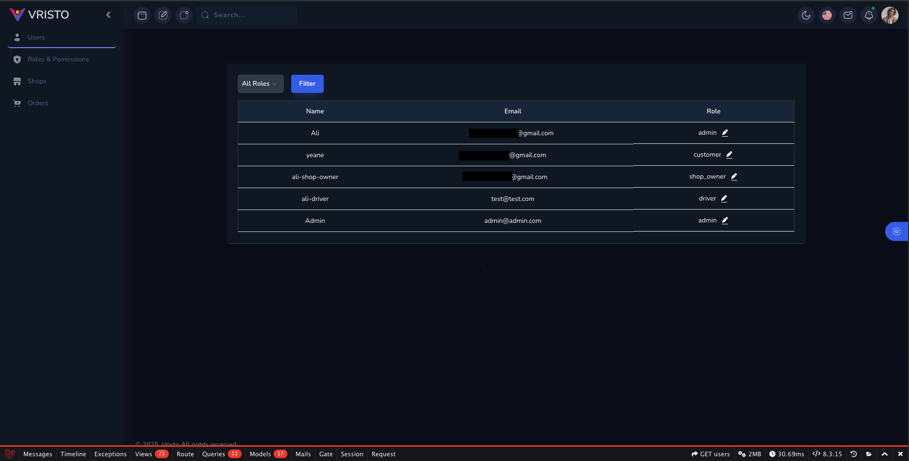
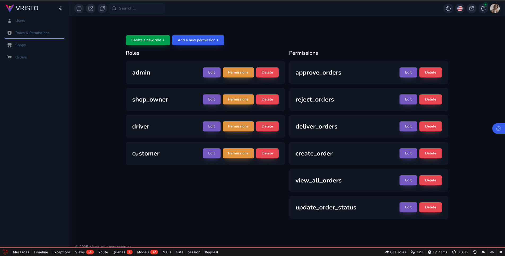
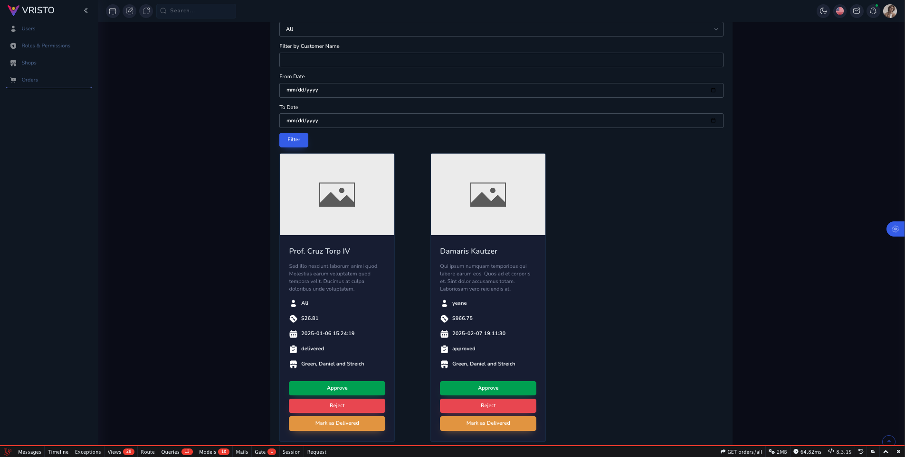

# 📦 Order Management System – Assessment Project

This project was built as part of a technical assessment for **Jiasaz**.

---

## 📄 Assessment Brief

Below is the original assessment document outlining the requirements:

---

## 🛠️ Implementation Overview

### 🔐 Role-Based Access
The project includes four defined roles:
- **Admin**
- **Customer**
- **Shop Owner**
- **Driver**

Each role has specific permissions defined and managed using the spatie/laravel-permission package, and checked dynamically during order transitions.

---

### 🚚 Order Workflow

I used the `sebdesign/laravel-state-machine` package to manage the order workflow.  
The states and transitions were defined in `config/state-machine.php` using the following setup:

#### States:
- `pending`
- `approved`
- `rejected`
- `delivered`

#### Transitions:
- `approve`: from `pending` → `approved`
- `reject`: from `pending` → `rejected`
- `deliver`: from `approved` → `delivered`

Each order is tied to a status, and transitions are triggered based on user permissions.  
For example:
- A **Customer** creates a new order → Status becomes `pending`
- A **Driver** with permission can `approve` or `reject` it
- Only the assigned **Driver** can `deliver` the approved order

Transitions are validated via:
- `can($transition)` method from the state machine
- Laravel permission checks (e.g. `deliver_orders`)

---

### 🧩 Features Implemented

- Order creation restricted to one active order per customer
- Filterable order lists (by status, customer name, and date range)
- Role-based access to actions
- Driver assignment to orders
- Dynamic workflow logic via config

---

## 🖼️ Project Screenshots

Here are some screenshots of the final project:

### 👤 Users Page

### 🧾 Roles & Permissions Page

### 📱 Orders page

